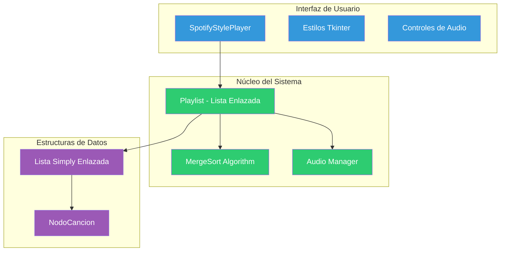

# Spotify Clone con Lista Simply Enlazada


## Descripción General
Este proyecto implementa un reproductor musical estilo Spotify utilizando una lista simplemente enlazada como estructura de datos principal. La aplicación incluye un algoritmo de ordenamiento MergeSort recursivo para organizar las canciones y una interfaz gráfica moderna desarrollada con Tkinter y PyGame.

## Características Principales
✅ Lista Simply Enlazada con operaciones CRUD completas

✅ Algoritmo MergeSort recursivo para ordenamiento

✅ Interfaz gráfica estilo Spotify con temas oscuros

✅ Reproducción de audio real archivos MP3

✅ Sistema de navegación entre canciones

✅ Ordenamiento por título, artista y duración

✅ Control de volumen integrado

✅ Documentación completa con diagramas Mermaid

## Arquitectura del Sistema

## Dependencias
```
# requirements.txt
pygame==2.5.0        # Reproducción de audio
pillow==10.0.0       # Manipulación de imágenes
```
## Uso de la Aplicación
*Reproducir canción: Doble clic en cualquier canción*

Controles de reproducción:

▶️⏸️ Play/Pause

⏭️ Siguiente canción

⏮️ Canción anterior

Ordenamiento: Botones para ordenar por título, artista o duración

Gestión de canciones:

➕ Añadir nuevas canciones

🗑️ Eliminar canciones existentes

Control de volumen: Slider en la parte inferior
## Implementación Técnica
### 1. Estructura de Lista Simply Enlazada
Clase NodoCancion
```
class NodoCancion:
    def __init__(self, titulo, artista, duracion, genero="Desconocido", archivo_audio=None):
        self.titulo = titulo          # Datos de la canción
        self.artista = artista        # Datos de la canción  
        self.duracion = duracion      # Datos de la canción
        self.genero = genero          # Datos de la canción
        self.archivo_audio = archivo_audio  # Ruta al archivo MP3
        self.siguiente = None         #  PUNTERO al siguiente nodo
```
## Operaciones de la Lista
```
class Playlist:
    def añadir_cancion(self, titulo, artista, duracion, genero, archivo_audio):
        # Inserta al final de la lista - O(n)
    
    def eliminar_posicion(self, posicion):
        # Elimina por posición - O(n)
    
    def siguiente(self):
        # Navega al siguiente nodo - O(1)
    
    def anterior(self):
        # Navega al nodo anterior - O(n) en lista simple
```
### 2. Algoritmo MergeSort Recursivo
- Implementación Recursiva
```
def _merge_sort(self, cabeza, criterio):
    """Algoritmo MergeSort recursivo para listas enlazadas"""
    # Caso base: lista vacía o de un elemento
    if cabeza is None or cabeza.siguiente is None:
        return cabeza
    
    # Dividir la lista en dos mitades (recursivo)
    mitad = self._dividir_lista(cabeza)
    izquierda = cabeza
    derecha = mitad
    
    # Llamadas recursivas para ordenar mitades
    izquierda_ordenada = self._merge_sort(izquierda, criterio)
    derecha_ordenada = self._merge_sort(derecha, criterio)
    
    # Fusionar las mitades ordenadas
    return self._fusionar(izquierda_ordenada, derecha_ordenada, criterio)
```
Complejidad Computacional

Operación	Complejidad	Descripción

MergeSort	O(n log n)	Óptimo para listas enlazadas

División	O(n)	Algoritmo tortuga y liebre

Fusión	O(n)	Comparación elemento por elemento

Proceso de Fusión
```
flowchart TD
    A[Inicio Fusión] --> B{¿Ambas listas tienen elementos?}
    B -->|Sí| C[Comparar primeros elementos]
    C --> D{¿Izquierda ≤ Derecha?}
    D -->|Sí| E[Añadir izquierdo<br/>avanzar izquierda]
    D -->|No| F[Añadir derecho<br/>avanzar derecha]
    E --> B
    F --> B
    B -->|No| G[Añadir elementos restantes]
    G --> H[Lista fusionada ordenada]
```
### 3. Interfaz Gráfica con Tkinter
```
class SpotifyStylePlayer:
    def setup_ui(self):
        # Configuración tema oscuro estilo Spotify
        self.colors = {
            'bg_dark': '#121212',
            'bg_light': '#181818', 
            'green': '#1DB954',
            'white': '#FFFFFF'
        }
        
        # Componentes principales
        self.sidebar = ttk.Frame()    # Navegación lateral
        self.header = tk.Canvas()     # Cabecera con gradiente
        self.tree = ttk.Treeview()    # Lista de canciones
        self.controls = ttk.Frame()   # Controles de reproducción
```
Componentes Principales

Sidebar: Navegación y listas de reproducción

Header: Gradiente verde con título

Treeview: Lista de canciones con columnas

Controls: Botones de reproducción y ordenamiento

Now Playing: Barra inferior con información

## Diagramas del Sistema
### Diagrama de Clases Completo
```
classDiagram
    class NodoCancion {
        -String titulo
        -String artista
        -int duracion
        -String genero
        -String archivo_audio
        -NodoCancion siguiente
        +__init__()
        +__str__()
        +formatear_duracion()
    }

    class Playlist {
        -String nombre
        -NodoCancion inicio
        -NodoCancion actual
        -int tamaño
        -bool reproduciendo
        -bool pausado
        +añadir_cancion()
        +eliminar_posicion()
        +ordenar_por_titulo()
        +ordenar_por_artista()
        +ordenar_por_duracion()
        +_merge_sort()
        +_dividir_lista()
        +_fusionar()
        +siguiente()
        +anterior()
    }

    class MusicPlayer {
        -Tk root
        -dict colors
        -Playlist playlist
        -ttk.Treeview tree
        +setup_ui()
        +actualizar_lista()
        +toggle_play()
        +siguiente()
        +anterior()
        +ordenar_por_titulo()
    }

    Playlist "1" *-- "*" NodoCancion : contiene
    MusicPlayer "1" *-- "1" Playlist : utiliza
```
### Flujo de Datos

```
sequenceDiagram
    participant Usuario
    participant GUI
    participant Playlist
    participant PyGame

    Usuario->>GUI: Doble clic en canción
    GUI->>Playlist: establecer como actual
    Playlist->>Playlist: detener_audio()
    Playlist->>PyGame: music.load(archivo_mp3)
    Playlist->>PyGame: music.play()
    PyGame-->>Playlist: reproducción iniciada
    Playlist-->>GUI: confirmación
    GUI->>GUI: actualizar_interfaz()
```